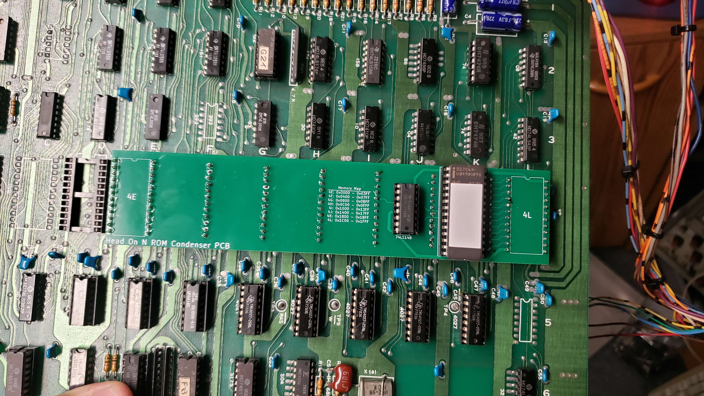

# Head-On-N-ROM-Condenser
ROM Consenser PCB to convert 8 2708 Tri-Voltage ROMs to a single 2764
## BOM
- 1: 74LS148
- 1: 2764 EPROM
- 1: 28 pin ROM Socket
- 10: 12 pin machine pin header pins for fitting into socket
## ROM Condensing
Assemble the 2764 ROM by merging the ROMs (you provide) together in the address.
| **ROM Location** | **Start Address** | **End Address** |
|------------------|-------------------|-----------------|
| 4E               | 0x0000            | 0x03FF          |
| 4F               | 0x0400            | 0x07FF          |
| 4G               | 0x0800            | 0x0BFF          |
| 4H               | 0x0C00            | 0X0FFF          |
| 4I               | 0x1000            | 0x13FF          |
| 4J               | 0x1400            | 0x17FF          |
| 4K               | 0x1800            | 0x1BFF          |
| 4L               | 0x1C00            | 0x1FFF          |
## Board Picture

